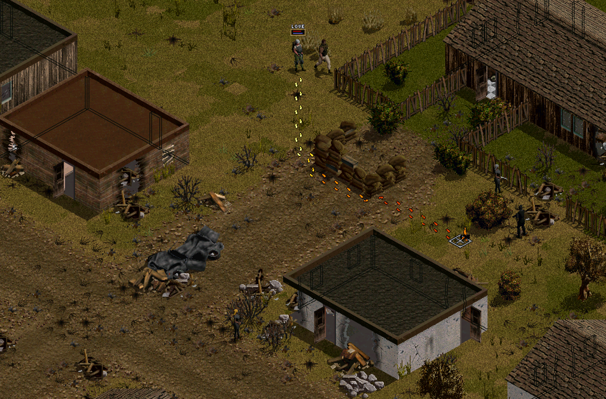

# FAQ

Q: Why are there Elites in Omerta when I start the game?!

A: You enabled Enemy Generals and Omerta (A9) is one of the spawning spots



---

Q: The difficulty setting "Experienced" is too easy, but "Expert" is too hard?!

A: Try setting "Progress Speed of Item Choices" to "Slow". One of the reasons why Expert is hard is due to how well kitted out Deiranna's elite troops are. Elites start at Cooldown 5 (of 10). "Slow" Progress Speed will reduce their coolness by 3 till you get to 10 progress, by 2 till 40 progress and finally by 1 till you get to 80 progress. 

Press "V" to see your current Max Progress (second number)

---

Q: I pressed some darned hotkey by accident and I broke my game!

A: This won't be an exhaustive list but we can try

- Cursor doesn't show a chance to hit anymore. Go to "Jagged Alliance 2/Profiles/UserProfile_JA2113/Ja2_Settings.INI" and change `TOPTION_CTH_CURSOR` to TRUE

---

Q: When my spy attacks even an admin manages to interrupt and kill them!

A: It seems like that the game will give a hefty malus to Mercs who do "suspicious activities" including to apply a knife to an enemy. It seems to work better if you do not attack in real-time mode but instead press CTRL + T to force turn based mode. You may need to remove the disguise in the $ screen first for best effects, before you plunge the knife into Deidranna's troops.

---

Q: Defending a sector with militia takes ages. How can I speed it up?

Open the INI Editor/Jagged Alliance 2/Data-1.13/Ja2_Options.INI and change the following values to your liking

```
;------------------------------------------------------------------------------------------------------------------------------
; Controls animation speed for faster movements in battle
; 1.0 = normal
; 0 = max speed 
; Range: 0-1.0 (fractions are allowed)
;------------------------------------------------------------------------------------------------------------------------------

PLAYER_TURN_SPEED_UP_FACTOR     = 1.0
ENEMY_TURN_SPEED_UP_FACTOR     = 1.0
CREATURE_TURN_SPEED_UP_FACTOR     = 1.0
MILITIA_TURN_SPEED_UP_FACTOR      = 0.2
CIVILIAN_TURN_SPEED_UP_FACTOR     = 0.0
```

I am not sure if Kingpin's men count as ENEMY or as CIVILIANS so alter the settings if needed.

---

Q: My people move so slow, why is that?

A: You may have a backpack equipped with gives an AP cost malues on moving/disallows climbing up to roofs.
...