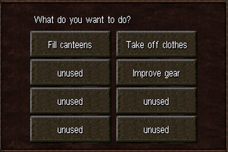
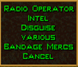
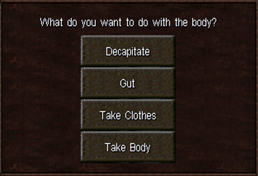
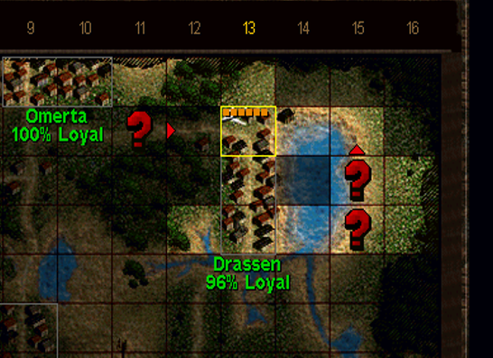

# Jagged Alliance 2 1.13 - Player Guide for new Features

This Guide isn't intended how to play JA2 properly. Instead this guide tries to gather and document all the different facettes/features 1.13 introduces into a central page.

This guide was written with the game version [JA2_113-v2-G3519Ld827-English](https://github.com/1dot13/source/releases/tag/v2) released 9th of April 2025. No further mods are considered.

## Hotkeys

### Movement and Stances

| Hotkey | Description |
| --- | --- |
| R | Running |
| S | Stand/Walking |
| L | Look/Change direction/Raise Weapon |
| PAGE UP | Change stance upwards/climb a roof |
| PAGE DOWN | Chance stance downwards/climb down a roof |
| ALT and left mouse click - Sidestepping, rolling to the side, walking/crawling backwards, etc. |
| Shift + J | Jump through windows |

### Targeting/Combat

| Hotkey | Description |
| --- | --- |
| . (dot) | Change Scope mode including firing from the hip |
| Shift+R | Reload (don't press 'R') |

## New Menus

### Utility

Hotkey: CTRL + "." (dot)

Allows:
- Fill canteens - Top off canteens in the inventory of all Mercs
- Improve gear - Checks sector inventory for items with better condition
- Take off clothes - Put disguise into inventory

### Skills 

Hotkey: $

Allows:
- Radio Operator
  - Jam Radio Communication - Stop reinforcements from coming in
  - ...
- Intel
  - Hide/Get Intel Assignment - Start assignment for the strategic view
  - Recruit/Activate (All) Turncoats
- Disguise
  - Disguise/Remove Disguise
  - Test Disguise - Determine if Disguise will hold. You may need to do changes to your inventory
  - Remove Clothes - Get the disguise items back
- Various
  - Spotter - Set up as Spotter for a Sniper
  - Focus - ???
  - Drag - Drag a Merc from the firing line or similar
  - Fill canteens
- Bandage Mercs - Shows the after battle bandaging screen

### "Knife Window"

Put a knife into a Merc's hand, right click and click on the tile where the enemy body lies/the enemy stood (most likely at the feet). This does not work anymore once the crows are enjoying their meals.

Allows:
- Decapitate - Take the head of a target. Bounty Hunters and similar folk will ask for proof.
- Gut - ???
- Take Clothes - Takes the uniform/clothing of a body

Taking clothes will result in pants and shirts, assuming you didn't not fire at the torso/leg hit zone. Otherwise they are too damaged to be of any use for covert ops.

## Crafting

Normal crafting see [here](https://thepit.ja-galaxy-forum.com/index.php?t=msg&th=23824&start=0&)

| Result | Ingredients |
| --- | --- |
| Rag | Knife + Shirt or Pant |
| Bandages | Rag + Rag |

## Facilities

### ACA Buildings

Staffing an ACA building with a Merc who has 75+ Wisdom and +30 Leadership and gather information about enemy patrols

## FAQ

Q: Why are there Elites in Omerta when I start the game?!

A: You enabled Enemy Generals and Omerta (A9) is one of the spawning spots

---

Q: The difficulty setting "Experienced" is too easy, but "Expert" is too hard?!

A: Try setting "Progress Speed of Item Choices" to "Slow". One of the reasons why Expert is hard is due to how well kitted out Deiranna's elite troops are. Elites start at Cooldown 5 (of 10). "Slow" Progress Speed will reduce their coolness by 3 till you get to 10 progress, by 2 till 40 progress and finally by 1 till you get to 80 progress. 

Press "V" to see your current Max Progress (second number)

---

Q: I pressed some darned hotkey by accident and I broke my game!

A: This won't be an exhaustive list but we can try

- Cursor doesn't show a chance to hit anymore. Go to "Jagged Alliance 2/Profiles/UserProfile_JA2113/Ja2_Settings.INI" and change `TOPTION_CTH_CURSOR` to TRUE

---

Q: When my spy attacks even an admin manages to interrupt and kill them!

A: It seems like that the game will give a hefty malus to Mercs who do "suspicious activities" including to apply a knife to an enemy. It seems to work better if you do not attack in real-time mode but instead press CTRL + T to force turn based mode. You may need to remove the disguise in the $ screen first for best effects, before you plunge the knife into Deidranna's troops.

---
...