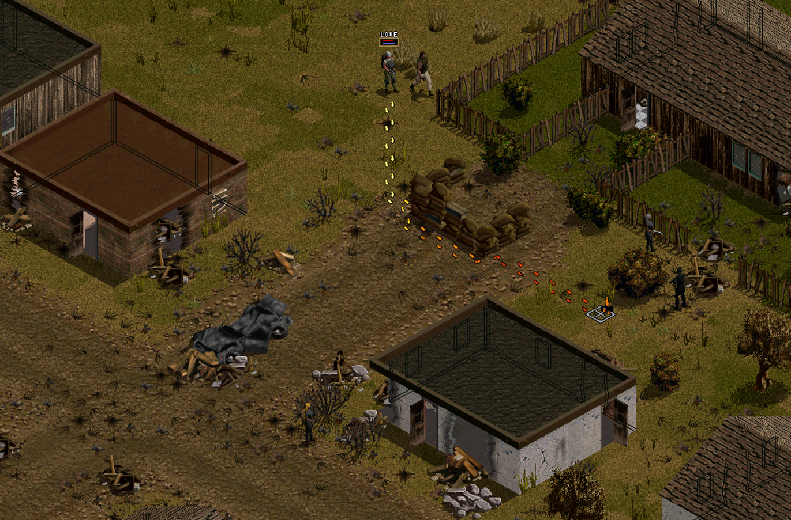

# Jagged Alliance 2 1.13 - Player Guide for new Features

## Hotkeys

### Movement and Stances

| Hotkey | Description |
| --- | --- |
| R | Running |
| S | Stand/Walking |
| L | Look/Change direction/Raise Weapon |
| PAGE UP | Change stance upwards/climb a roof |
| PAGE DOWN | Chance stance downwards/climb down a roof |
| ALT and left mouse click - Sidestepping, rolling to the side, walking/crawling backwards, etc. |
| Shift + J | Jump through windows |

### Targeting/Combat

| Hotkey | Description |
| --- | --- |
| . (dot) | Change Scope mode including firing from the hip |
| Shift+R | Reload (don't press 'R') |

## FAQ

Q: Why are there Elites in Omerta when I start the game?!

A: You enabled Enemy Generals and Omerta (A9) is one of the spawning spots

---

Q: The difficulty setting "Experienced" is too easy, but "Expert" is too hard?!

A: Try setting "Progress Speed of Item Choices" to "Slow". One of the reasons why Expert is hard is due to how well kitted out Deiranna's Elite Troops. Elites start at Cooldown 5 (of 10). "Slow" Progress Speed will reduce their coolness by 3 till you get to 10 progress, by 2 till 40 progress and finally by 1 till you get to 80 progress. 

Press "V" to see your current Max Progress (second number)

---

Q: I pressed some darned hotkey by accident and I broke my game!

A: This won't be an exhaustive list but we can try

- Cursor doesn't show a chance to hit anymore. Go to "Jagged Alliance 2/Profiles/UserProfile_JA2113/Ja2_Settings.INI" and change `TOPTION_CTH_CURSOR` to TRUE